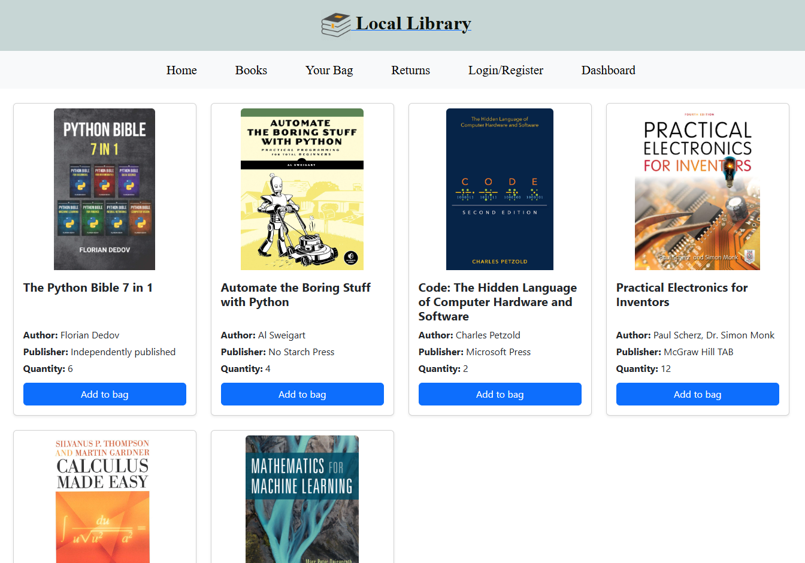

(Work in progress)

📚 Local Library
A library management system that allows users to rent books.

✨ Features (to be implemented)
User registration and authentication
Viewing and managing books
Book rental and return
Admin dashboard for book and user management
Simple and user-friendly design

🛠️ Built With

      

📸 Screenshots

🖥️ Welcome Page

📚 Book List

⚙️ Installation
To set up this project locally:

1️⃣ Clone the repository
git clone https://github.com/adelinprelipcean/my_library_site.git
cd my_library_site

2️⃣ Create and activate a virtual environment
python -m venv venv
source venv/bin/activate      # On macOS/Linux
venv\Scripts\activate.bat     # On Windows

3️⃣ Install dependencies
pip install -r requirements.txt

4️⃣ Apply migrations
python manage.py migrate

5️⃣ Start the development server
python manage.py runserver
Open http://127.0.0.1:8000/ to see the project in action.

🔮 Roadmap
 Implement all book borrowing features (borrow/return)

 Implement shopping basket

 Add admin and user panels

 Implement search functionality for books

 Add user profile pages

 Improve responsive design

🤝 Contributing
Pull requests are welcome! For major changes, please open an issue first to discuss what you would like to change.

📞 Contact
Feel free to reach out to me at aamoviescontact@gmail.com.
